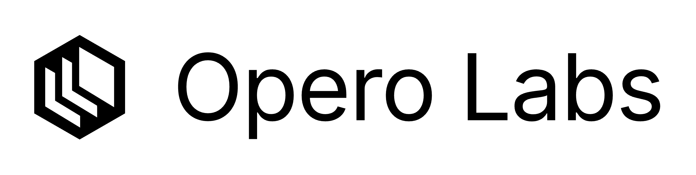

# Welcome to [Opero Labs](https://operolabs.com)!

## What does Opero Labs do?

Opero Labs develops browser agents by working on both the model and the infrastructure side. Leveraging this, we are currently building a chrome extension browser agent.

## [Browserstation](https://github.com/operolabs/browserstation)

Browserstation is our first open source project. We built Browserstation when we noticed existing infrastructure couldn't meet the scalability needed to train Opero-1.It gives agents and scrapers full browser capabilities, with the ability to debug locally and scale to production without being locked into proprietary infrastructure.

## Opero-1

Opero-1-30B is an in-house trained for completing tasks on the browser. We will release more information about this soon.

## Contributions

We invite contributions to Browserstation. Please see our [production roadmap](https://github.com/operolabs/browserstation) for more information.

## Contact

Reach out to us on [X](https://x.com/operolabs) or [LinkedIn](https://www.linkedin.com/company/opero-labs), or email the founders: [Guido Trevisan](mailto:guido@operolabs.com), [Beau Hayes-Pollard](mailto:beau@operolabs.com), and [Conrad Wichmann](mailto:conrad@operolabs.com).